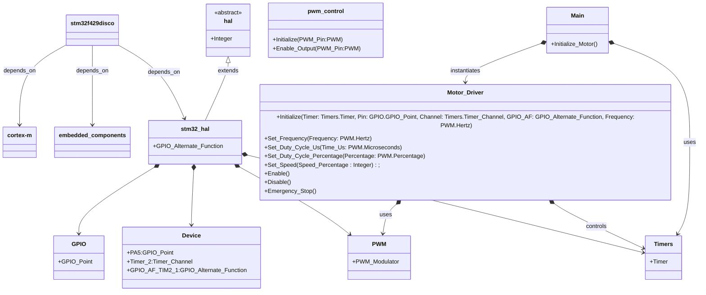

# Drive Motor Package - VDI-ADC Modular System

**Capstone Project:** Modular Autonomous Driving System for VDI Challenge Project  
**Hardware Platform:** STM32F429 Discovery Board  
**Programming Language:** Ada

---

## 📋 Overview

The **Drive Motor Package** controls motor speed, direction, and power using **PWM signals** on the **STM32F429 Discovery Board**. It supports:

- PWM control with configurable frequency and duty cycle
- Soft stops and emergency stop functionality
- MOSFET-based power control
- UART-based logging for debugging and testing

---

## ⚡ PWM Configuration

**PWM is generated using STM32 Timers and GPIO pins.** Below are the pin configurations for PWM signals:

| Function  | Timer   | GPIO Pin | Timer Channel | Alternate Function |
|-----------|--------|----------|---------------|---------------------|
| Drive PWM | Timer 4 | PB7      | Channel 2     | GPIO_AF_TIM4_2     |
| Drive Mosfet | N/A | PC8      | N/A     | N/A     |

---

## 📊 PWM Output Examples

[Demo Video](https://psu.mediaspace.kaltura.com/media/drive_test_19FEB2025/1_2dv4cfyu)

---

## 🏗️ Hardware Architecture



## Useful Information

### Show all connected communication devices

```bash
ls /dev/tty.*
```

### Connect via COM port using screen

```bash
screen /dev/tty.usbmodem2303 115200
```

### Using OpenOCD to write to STM32

```bash
openocd -f "/openocd/scripts/board/stm32f429discovery.cfg" -c "program /VDI-ADC-Modular-System/drive_motor/bin/main verify reset exit"
```

## Testing

### Test TC-025 Output

```terminal
 === TC-025: Acceleration Response Test ===
Connect scope to PB7. Press [y] to continue or [n] to abort...
yMotor Initialized.
Motor Enabled (via Enable procedure).
Motor Power On - Calibrating...
Calibrated
Setting 5% speed...
TAKE SCOPE CAPTURE NOW (5% Speed). Press y to continue...
yAcceleration time: Time:  0s  3533ns - TAKE 20% CAPTURE NOW
Press ENTER to power down...
```

### Test TC-026 Output

```terminal
 === TC-026: Deceleration Response Test ===
Connect scope to PB7. Press [y] to continue or [n] to abort...
yMotor Initialized.
Motor Enabled (via Enable procedure).
Motor Power On - Calibrating...
Calibrated
Setting 20% speed...
TAKE SCOPE CAPTURE NOW (20% Speed). Press y to decelerate...
yDeceleration time: Time:  0s  3500ns - TAKE 5% SPEED CAPTURE NOW
Press y to power down...
```

### Test TC-027 Output

```terminal
  === TC-027: Emergency Stop Test ===
Connect scope to PB7. Press [y] to continue or [n] to abort...
yMotor Initialized.
Motor Enabled (via Enable procedure).
Motor Power On - Calibrating...
Calibrated
Running at 20% speed...
TAKE SCOPE CAPTURE NOW (20% Speed). Press y to trigger emergency stop...
yEMERGENCY STOP - Motor Power Cut!
Emergency stop time: Time:  0s  100556150ns - VERIFY MOTOR STOPPED IMMEDIATELY
Press y to power down...
```
