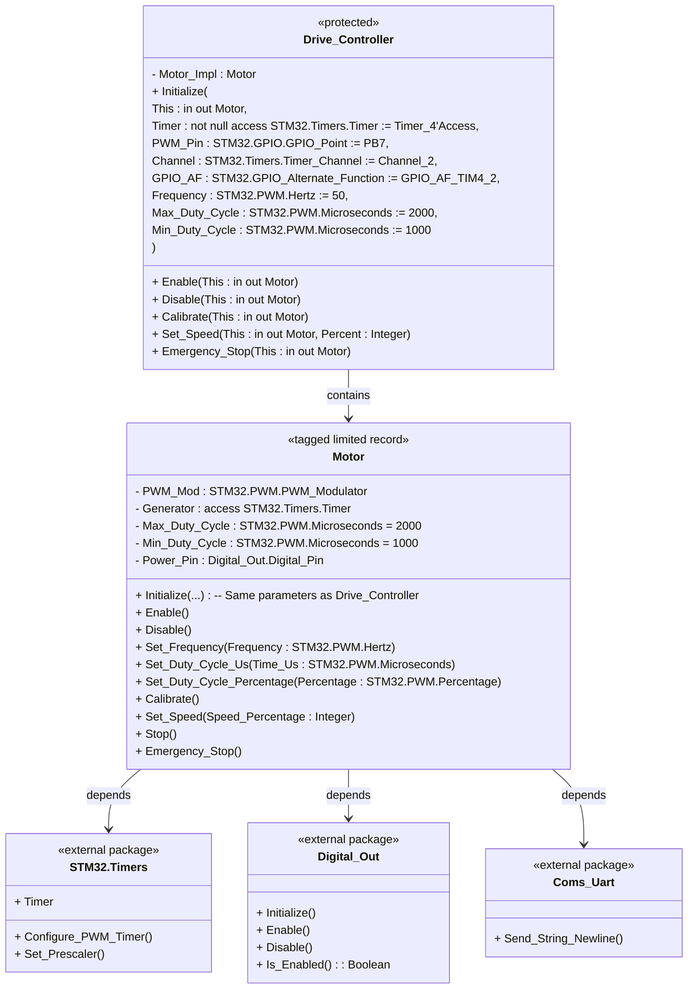
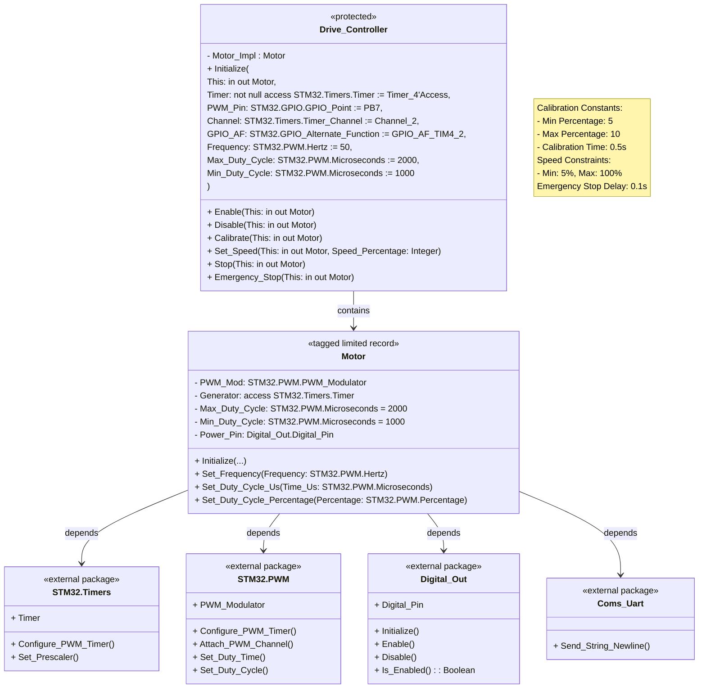

## Drive Motor

## Steering Motor

─────────────────────────────  
**1. UART Input and Command Parsing**  
• The process begins in the UART task (in the Coms_Uart package) where user input is received via the serial port.  
• The procedure Process_Command in Coms_Uart interprets the input string (for example, “MOTOR CALIBRATE” or “MOTOR SET SPEED”) and, based on the match, prepares a corresponding command.  
• Instead of acting on the command immediately, the UART task enqueues it using the Put entry of the Command_Queue’s Main_Queue.  
  – Example:  
    Command_Queue.Main_Queue.Put(Calibrate_Motor, (Speed => 0));  
 This ensures that the command is available for other tasks to process.

─────────────────────────────  
**2. Command Queue Management**  
• The Command_Queue package defines a protected type Queue with two key entries:  
  – **Put:** Inserts a command and its parameter into circular buffers (Cmd_Buffer and Param_Buffer).  
  – **Get:** Blocks until there is at least one command (Count > 0) and then removes a command from the buffers.  
• By using a circular-buffer design, the queue handles the producer–consumer pattern:
  – The UART task (producer) calls Put.
  – The Motor_Task (consumer) calls Get.

─────────────────────────────  
**3. Motor Command Processing**  
• The Motor_Task, defined within the Drive_Motor package, is a task that loops indefinitely.  
• At startup, Motor_Task prints its startup message via Coms_Uart and then initializes the motor by calling:
  – Drive_Motor.Initialize(Global_Motor);
  – Drive_Motor.Enable(Global_Motor);
 where Global_Motor is the global motor instance declared in Drive_Motor.
• Inside the loop, Motor_Task calls:  
  Command_Queue.Main_Queue.Get(Cmd, Param);
 This call blocks until a command is available.
• Once a command is retrieved, Motor_Task uses a case statement on the command (Cmd of type Commands.Command_Type) to determine which motor function to call:
  – **Calibrate_Motor:** Calls Drive_Motor.Enable(Global_Motor) (and possibly calibrates the motor).  
  – **Set_Motor_Speed:** Calls Drive_Motor.Set_Speed(Global_Motor, Param.Speed) to adjust the motor’s speed.  
  – **Motor_Stop:** Calls Drive_Motor.Stop(Global_Motor).  
  – **Emergency_Stop:** Calls Drive_Motor.Emergency_Stop(Global_Motor).  
  – **Exit_Command:** Causes the task loop to exit.
• After processing, the loop repeats to fetch the next command.

─────────────────────────────  
**4. Low-Level Motor Control**  
• The Drive_Motor package provides the low-level routines that interact with hardware:  
  – **Initialize:** Sets up the PWM timer (using STM32.PWM and STM32.Timers) and configures the output pin (via STM32.GPIO and Digital_Out).  
  – **Set_Speed:** Computes the required PWM duty cycle based on a given percentage and updates the PWM output.  
  – **Stop/Emergency_Stop:** Safely stop the motor and disable outputs.
• These procedures use the hardware-abstraction layers (e.g., HAL, STM32.Device) to directly control the motor hardware on the STM32F429 Discovery board.

─────────────────────────────  
**5. Overall Flow Summary**  
1. **UART Reception:** The UART task (Coms_Uart) receives a command string and, via Process_Command, determines that a motor command is intended.  
2. **Enqueue Command:** The command is enqueued into Command_Queue.Main_Queue using the Put entry.  
3. **Queue Retrieval:** The Motor_Task (within Drive_Motor) continuously waits on the queue by calling Get.  
4. **Command Dispatch:** Once a command is available, Motor_Task dispatches the command to the appropriate Drive_Motor routine (such as Set_Speed, Stop, or Emergency_Stop) on the global motor instance (Global_Motor).  
5. **Motor Action:** The Drive_Motor routines interact with the underlying hardware drivers (STM32.PWM, STM32.Timers, etc.) to execute the command and control the motor.
6. **Loop Continuation:** The system continues to process commands until an Exit_Command is received, which causes Motor_Task to terminate its loop.

