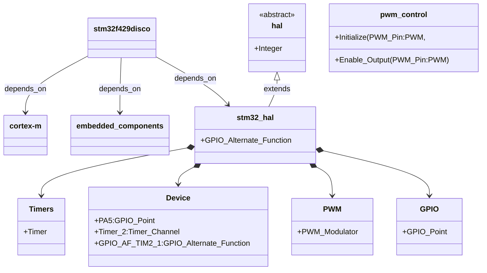

# VDI-ADC-Modular-System
Capstone Project: Modular Autonomous Driving System for VDI Challenge Project 

## PWM using Ada on STM32F429Disco

Here’s the updated Markdown table with only the two pins, leaving the function column blank for now:

| Function | Timer   | GPIO Pin | Timer Channel | Alternate Function |
|----------|---------|----------|---------------|---------------------|
|          | Timer_4 | PB7      | Channel_2     | GPIO_AF_TIM4_2     |
|          | Timer_2 | PA5      | Channel_1     | GPIO_AF_TIM2_1     |


This format keeps it flexible until you finalize which pin will be used for which function. Let me know if you need further adjustments!

## Hardware Architecture



## Useful Information

```bash
    alr index 

    # NAME      URL                                                           
    1 gap       git+https://github.com/GNAT-Academic-Program/alire-index      
    2 community git+https://github.com/alire-project/alire-index#stable-1.3.0 

    alr toolchain --select gnat_arm_elf=12.2.1

    openocd -f "C:/xpack-openocd-0.12.0-4/openocd/scripts/board/stm32f429disc1.cfg" -c "program C:/Code/VDI-ADC-Modular-System/pwm_control/bin/main verify reset exit"
```
                 


